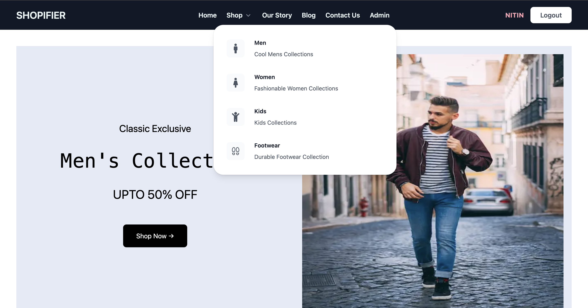
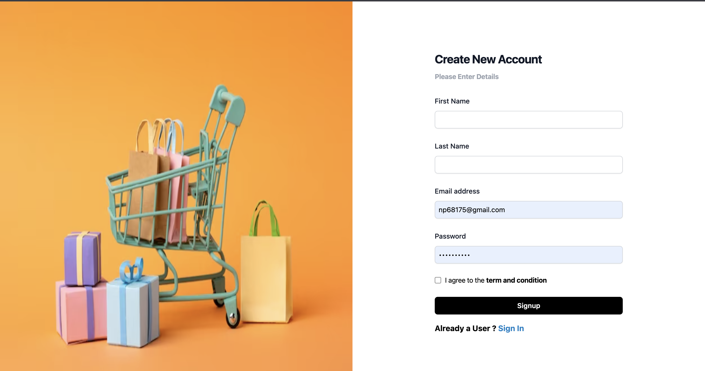
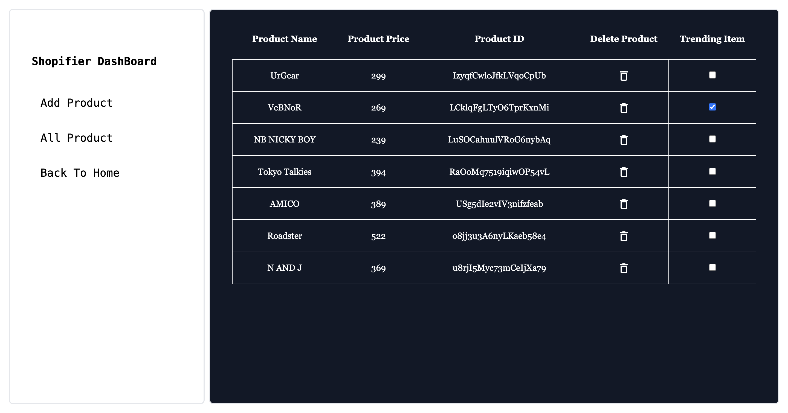
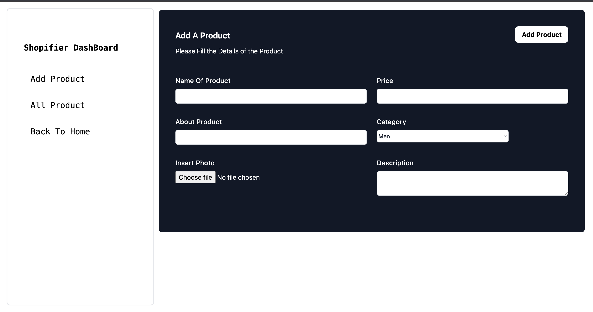
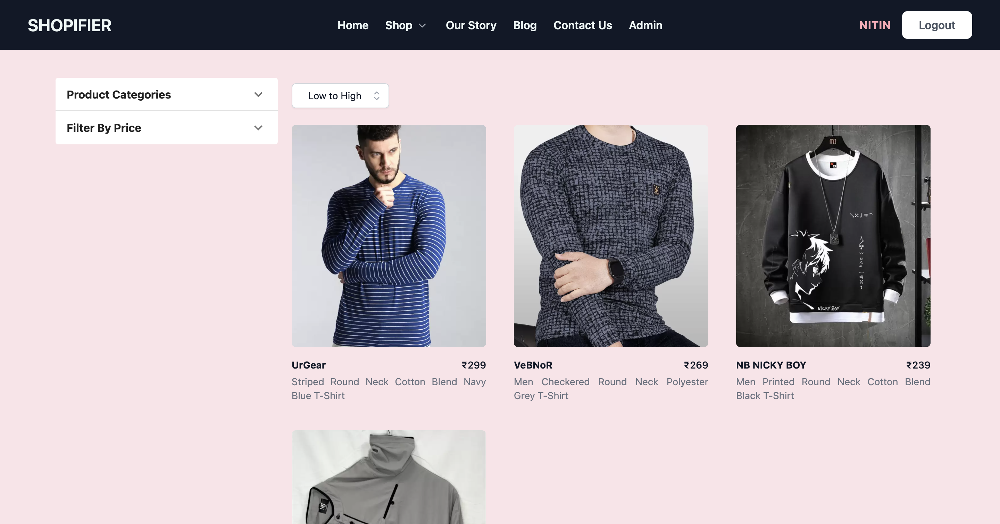
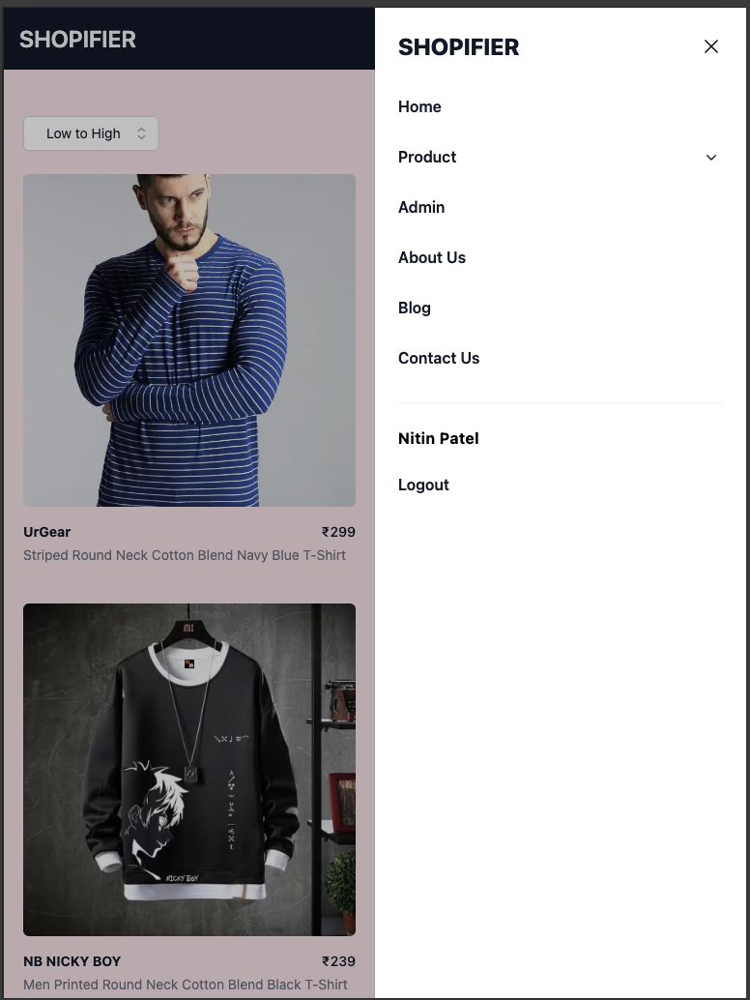

# Project Title

Shopifier

## Demo Link

Access this site: https://nitin-shopifier.netlify.app/

## Table of Content

- About
- ScreeShot
- Technologies
- Setup for Local
- Status

## About

The Database used is firestore to store all the Details and Authentication Part is created using Firebase auth and Images are stored into storage provided by firebase. People can save their product into the Cart and make payment using Razorpay Payment Portal.

Hope You Love it !! ❤️

## ScreenShot












## Technologies

- React
- Tailwind CSS
- React Router DOM
- Context API
- Redux
- Razorpay API Integration
- Firebase Auth
- Firebase Firestore
- Firebase Storage
- HTML
- CSS
- Javascript
- Axios

## Setup for Local

- download or clone the repository
- Create and Account on Firebase and create Authenication with email and password.
- Create Realtime database ( Firestore ) and Storage
- Create .env file in the root directory and structre should be like this and fill the details

    ```
        REACT_APP_ADMIN_EMAIL=''
        REACT_APP_APIKEY=''
        REACT_APP_AUTHDOMAIN=''
        REACT_APP_PROJECTID=''
        REACT_APP_STORAGEBUCKET=''
        REACT_APP_MESSEGINGSENDERID=''
        REACT_APP_APPID=''
        REACT_APP_MEASUREMENTID=''
    ```
- run npm install
- run npm start

## Version Update

  Soon